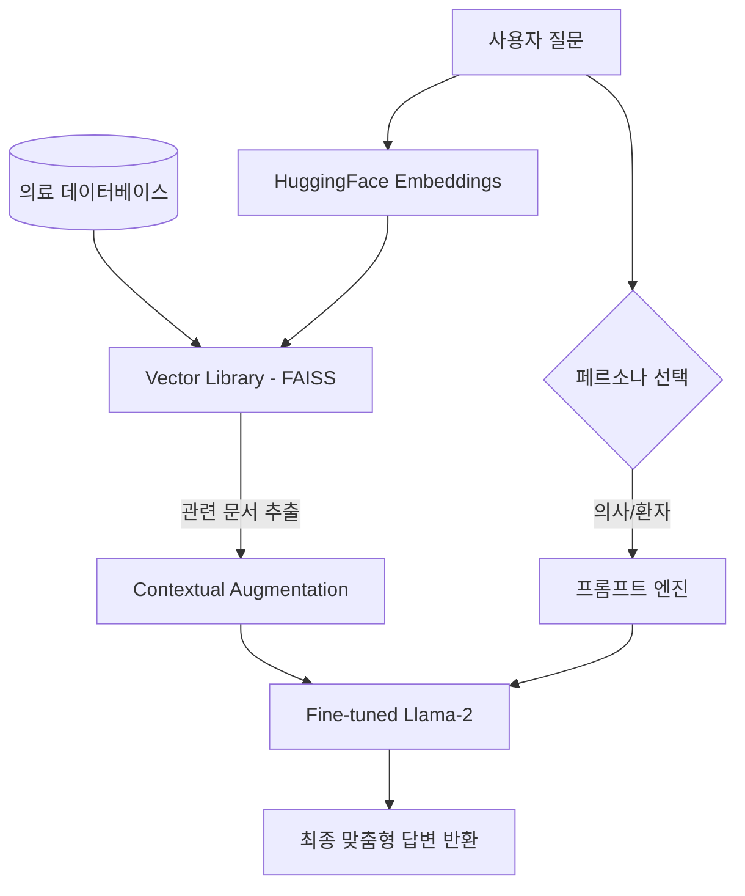

# 🏥 MediChat Pro: Medical AI Assistant

> **#LLM #RAG #MedicalAI #GenerativeAI #Llama2 #FAISS #Streamlit #PharmaceuticalAI**

**MediChat Pro**는 제약 서비스 및 의료 전문가를 위한 고성능 **RAG(Retrieval-Augmented Generation)** 기반 의료 AI 챗봇입니다. **Llama-2** 모델을 의료 데이터에 맞게 Fine-tuning 하였으며, 사용자의 역할(의사/환자)에 따른 **Dual Persona** 답변 시스템을 제공합니다.

---

## 🚀 Key Features

- **#DualPersona 시스템**: 사용자의 선택에 따라 전문적인 의학 용어를 사용하는 '의사 모드'와 쉽고 친절한 '환자 모드'로 답변 스타일이 자동 전환됩니다.
- **#RAG (Retrieval-Augmented Generation)**: 최신 의학 가이드라인 및 제약 데이터(PDF, TXT)를 실시간으로 검색하여 근거 중심의 정확한 정보를 제공합니다.
- **#LLM Optimization**: **QLoRA (4-bit Quantization)** 기술을 적용하여 일반적인 GPU 환경에서도 고성능 모델을 효율적으로 구동합니다.
- **Interactive UI**: Streamlit 기반의 현대적이고 직관적인 의료용 대시보드 인터페이스를 제공합니다.

---

## 🛠 Tech Stack

| Category         | Technology                                  |
| :--------------- | :------------------------------------------ |
| **Model**        | `Llama-2-7B-Chat-hf` (with Medical Adapter) |
| **Quantization** | `BitsAndBytes` (4-bit QLoRA)                |
| **Framework**    | `LangChain`, `Streamlit`                    |
| **Vector DB**    | `FAISS`                                     |
| **Embeddings**   | `HuggingFace (sentence-transformers)`       |

---

## 🏗 System Architecture



---

## ⚙️ How to Setup

### 1. 환경 구축 (Installation)
프로젝트 실행을 위해 필요한 라이브러리를 설치합니다.
```bash
pip install -r requirements.txt
```

### 2. 데이터 인덱싱 (Data Ingestion)
`data/` 폴더에 의학 문서(PDF, TXT, MD)를 넣은 후 벡터 DB를 생성합니다.
```bash
python ingest.py
```

### 3. 서비스 실행 (Run Application)
Streamlit 서버를 구동하여 챗봇을 실행합니다.
```bash
streamlit run app.py
```

---

## 🌐 Deployment (Streamlit Cloud)

본 프로젝트는 **Streamlit Community Cloud**를 통해 쉽게 배포할 수 있습니다.

1. 이 레포지토리를 본인의 GitHub 계정으로 **Fork** 또는 **Push**합니다.
2. [Streamlit Cloud](https://share.streamlit.io/)에 접속하여 GitHub 계정으로 로그인합니다.
3. **'New app'**을 클릭하고 해당 레포지토리와 `app.py` 경로를 지정합니다.
4. **Environment Variables (Secrets)**에 필요한 API 키나 환경 설정을 등록합니다.
5. **'Deploy!'** 버튼을 누르면 웹 사이트가 즉시 생성됩니다.

---

## ⚠️ Disclaimer
본 서비스는 인공지능 기반의 정보 제공 시스템이며, 전문적인 의학적 진단을 대신할 수 없습니다. 실제 진단 및 처방은 반드시 전문의와 상담하십시오.

---

### Contact
Developer: 김은우
